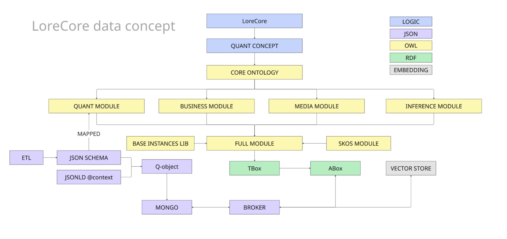
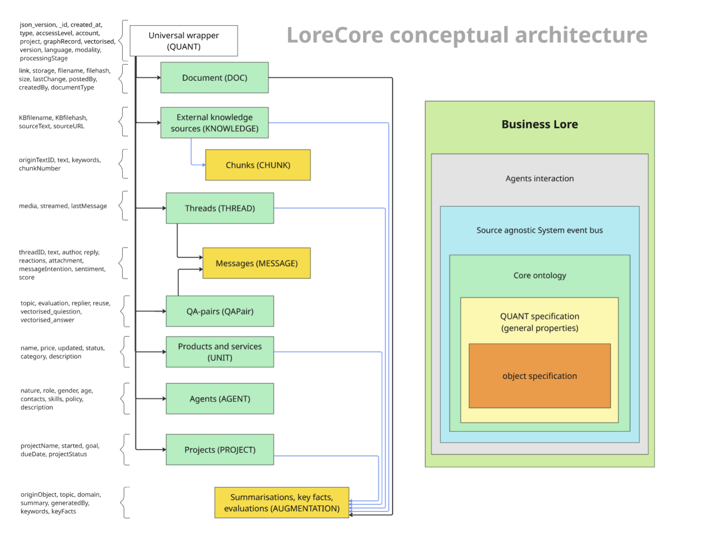

# Cпецификация онтологии CORE v1.0.0

## Введение

Онтология `CORE` представляет собой семантическую основу для описания данных мультиагентной нейросимволической системы LoreCore. Она разработана для обеспечения консистентности, интерпретируемости, машиночитаемости и автономной расширяемости корпоративных графов знаний.

Онтология `CORE` имеет модульную структуру, состоящую из четырех основных модулей:

1. Quant - ядро онтологии, содержащее базовые классы и их свойства
2. Media - модуль для описания медиаресурсов
3. Inference - модуль для работы с выводами и результатами анализа
4. Biz - модуль для описания бизнес-процессов

Эти модули объединяются в единую полную онтологию (Full), обеспечивая целостную семантическую структуру для всей системы LoreCore.

На схеме показан общий принцип организации данных в системе LoreCore


________

## Общие принципы

### Пререквизиты

- CORE онтология включает в себя структуру, представленную в схемах QUANT (Система универсальных JSON-схем для управления знаниями и контентом QUANT_v1 (vq1))
- Каждое свойство в схеме QUANT имеет строгое соответствие (маппинг) на онтологический класс, отношение или литерал
- CORE обладает дополнительными классами и свойствами, не представленными в схемах, но имеющими большое значение для интерпретируемости
- CORE используется как базовая схема при построении графа знаний
- Граф знаний состоит из RDF триплетов вида субъект-предикат-объект
- Версионирование объектов внутри графа знаний реализуется через сам граф знаний
- Запросы к графу знаний реализуются через SPARQL
- Конвенция имен - camelCase
________

## Структура QUANT

Каждый объект имеет двухслойную структуру: специфика обернута в универсальную схему QUANT. Таким образом унифицируется любой объект в системе.  
У каждого объекта есть свой уникальный ID, пространство имен UUID5 указано в основной спецификации LoreCore. ID внутри онтологии определен как уникальный URI идентификатор объекта.  
В схеме, помимо QUANT (враппера), есть 10 базовых классов объектов. Внутри схем есть два основных типа атрибутов:  

1. Атрибут типа примитив (строка, bool, int и так далее) - описываются как свойства данных (литералы)
2. Атрибут типа объект (словарь, список, множество, вложенные объекты) - описываются как свойства объектов и формируют новые объекты внутри онтологии
3. Атрибут как ссылка на другой объект по UUID - описываются как свойства объектов и формируют новые связи внутри онтологии

Существует 11 базовых классов с однозначным соответствием QUANT-JSON <-> OWL, кроме того есть дополнительные классы для описания сложных атрибутов в схемах JSON и суперклассы для описания явлений существующих или тех которые будут появлятся в будущем внутри системы LoreCore.
________

## Модуль Quant (quant.ttl)

### Описание 
Модуль Quant является центральным ядром онтологии CORE. Он содержит базовые классы и свойства, которые используются во всех остальных модулях. Этот модуль определяет структуру QUANT (Quantum Object), которая обеспечивает универсальный "обертывающий" слой для всех объектов системы.



Модуль Quant является входной точкой для всего графа знаний, то есть в автоматическом режиме в граф знаний могут попать только объекты `QUANT`, поэтому для этого класса определен маппинг на JSON-SCHEMA, для других классов в онтологии явный маппинг не предусмотрен и реализован частично в отдельных модулях системы LoreCore. 

### Основные классы модуля Quant

**Quant**

JSON-SCHEMA: `vq1_quant_schema.json`

Маппинг:  

| JSON поле        | Тип           | Тип данных       | Примечание                                                           |
|-----------------:|:--------------|:-----------------|:---------------------------------------------------------------------|
| jsonVersion      | DataProperty  | xsd:string       | Функциональное свойство                                              |
| _id              | URI           | string           | Используется как идентификатор в URI                                 |
| createdAt        | DataProperty  | xsd:dateTime     | Функциональное свойство                                              |
| updatedAt        | DataProperty  | xsd:dateTime     | Дата последнего обновления, не обязательное                          |
| type             | Class         |                  | Формально не мапиться так как это сам класс                          |
| accessLevel      | DataProperty  | xsd:int          | Целое число от 0 до 6                                                |
| fromAccount      | ObjectProperty| core:Account     | содержит UUID аккаунта (по нему строится URI)                        |
| fromProject      | ObjectProperty| core:Project     | содержит UUID проекта (по нему строится URI)                         |
| graphRecord      | URI           | xsd:string       | не мапиться в онтологии, метка для MONGO                             |
| vectorised       | DataProperty  | xsd:string       | Строковый индекс в векторном хранилище                               |
| version          | DataProperty  | xsd:int          | Порядковый номер версии                                              |
| primaryModality  | ObjectProperty| core:Modality    | Указание на класс основной модальности объекта UUID URI              |
| secondaryModality| ObjectProperty| core:Modality    | Указание на класс дополнительной модальности объекта UUID URI        |
| processingStage  | DataProperty  | xsd:string       | Стадия обработки объекта (создан, аугментирован, завершён)           |
| hasParent        | ObjectProperty| core:Quant       | Объект имеет родительский объект                                     |


Класс Quant является родительским для всех объектов в системе. Он содержит общие метаданные и служебные поля, необходимые для всех объектов:
```Turtle
<https://lorecore.ai/ont/core.ttl#Quant> rdf:type owl:Class ;
                                         rdfs:subClassOf [ rdf:type owl:Restriction ;
                                                           owl:onProperty <https://lorecore.ai/ont/core.ttl#fromAccount> ;
                                                           owl:minQualifiedCardinality "1"^^xsd:nonNegativeInteger ;
                                                           owl:onClass <https://lorecore.ai/ont/core.ttl#Account>
                                                         ] ,
                                                         [ rdf:type owl:Restriction ;
                                                           owl:onProperty <https://lorecore.ai/ont/core.ttl#primaryModality> ;
                                                           owl:qualifiedCardinality "1"^^xsd:nonNegativeInteger ;
                                                           owl:onClass <https://lorecore.ai/ont/core.ttl#Modality>
                                                         ] ,
                                                         [ rdf:type owl:Restriction ;
                                                           owl:onProperty <https://lorecore.ai/ont/core.ttl#createdAt> ;
                                                           owl:qualifiedCardinality "1"^^xsd:nonNegativeInteger ;
                                                           owl:onDataRange xsd:dateTime
                                                         ] ,
                                                         [ rdf:type owl:Restriction ;
                                                           owl:onProperty <https://lorecore.ai/ont/core.ttl#jsonVersion> ;
                                                           owl:qualifiedCardinality "1"^^xsd:nonNegativeInteger ;
                                                           owl:onDataRange xsd:string
                                                         ] ,
                                                         [ rdf:type owl:Restriction ;
                                                           owl:onProperty <https://lorecore.ai/ont/core.ttl#version> ;
                                                           owl:qualifiedCardinality "1"^^xsd:nonNegativeInteger ;
                                                           owl:onDataRange xsd:int
                                                         ] ;
                                         <http://purl.org/dc/elements/1.1/date> "2025-04-23T07:24:08Z"^^xsd:dateTime ;
                                         rdfs:comment "Ядром системы является базовая схема `QUANT` (Quantum Object), которая определяет общие поля и метаданные для всех объектов" .
```


**Agent**

JSON-SCHEMA: `vq1_agent_schema.json`

Маппинг:  

| JSON поле        | Тип           | Тип данных           | Примечание                                                       |
|-----------------:|:--------------|:---------------------|:-----------------------------------------------------------------|
| agentNature      | ObjectProperty| core:[User, Service] | Функциональное свойство, указывает на  классы User или Service   |
| hasName          | DataProperty  | xsd:string           | Системное имя агента                                             |
| agentRole        | ObjectProperty| core:Role            | Описание роли агента в системе                                   |
| gender           | DataProperty  | xsd:string           | Гендер агента                                                    |
| age              | DataProperty  | xsd:int              | Условный возраст агента                                          |
| hasSkill         | ObjectProperty| core:Skill           | Способности, функции, должностные инструкции                     |
| agentPolicy      | ObjectProperty| core:Policy          | Описание стратегии действий агента                               |
| hasDescription   | ObjectProperty| core:Description     | Суммаризация агента и его поведения (досье)                      |


Класс Agent описывает как реальных людей, так и ботов, которые взаимодействуют с системой:
```Turtle
<https://lorecore.ai/ont/core.ttl#Agent> rdf:type owl:Class ;
                                         rdfs:subClassOf <https://lorecore.ai/ont/core.ttl#Quant> ,
                                                         [ rdf:type owl:Restriction ;
                                                           owl:onProperty <https://lorecore.ai/ont/core.ttl#agentRole> ;
                                                           owl:minQualifiedCardinality "1"^^xsd:nonNegativeInteger ;
                                                           owl:onClass <https://lorecore.ai/ont/core.ttl#Role>
                                                         ] ,
                                                         [ rdf:type owl:Restriction ;
                                                           owl:onProperty <https://lorecore.ai/ont/core.ttl#agentNature> ;
                                                           owl:cardinality "1"^^xsd:nonNegativeInteger
                                                         ] ,
                                                         [ rdf:type owl:Restriction ;
                                                           owl:onProperty <https://lorecore.ai/ont/core.ttl#hasName> ;
                                                           owl:qualifiedCardinality "1"^^xsd:nonNegativeInteger ;
                                                           owl:onDataRange xsd:string
                                                         ] ;
                                         <http://purl.org/dc/elements/1.1/creator> "Andrey Khalov" ;
                                         <http://purl.org/dc/elements/1.1/date> "2025-04-23T11:39:25Z"^^xsd:dateTime ;
                                         rdfs:comment "Схема `vq1_agent_schema.json` используется для описания агентов - как реальных людей, так и ботов, которые взаимодействуют с системой."@ru .
```


**Augmentation**

JSON-SCHEMA: `vq1_augmentation_schema.json`

Маппинг:  

| JSON поле        | Тип           | Тип данных           | Примечание                                                       |
|-----------------:|:--------------|:---------------------|:-----------------------------------------------------------------|
| originObject     | ObjectProperty| core: Quant          | Указание на исходный объект аугментации                          |
| hasTopic         | ObjectProperty| core: Topic          | Указание на тему фрагмента, получено через инференс              |
| hasDomain        | ObjectProperty| core: Domain         | Указание на домен                                                |
| hasSummary       | ObjectProperty| core: Summarisation  | Может быть только 1 суммаризация                                 |
| generatedBy      | ObjectProperty| core: Agent          | Указание на автора аугментации UUID агента                       |
| keyWord          | ObjectProperty| core: Keyword        | Список итеративно распарсивается на отдельные объекты (?)        |
| keyFact          | ObjectProperty| core: KeyFact        | Список итеративно распарсивается на отдельные объекты (?)        |


Класс Augmentation представляет короткую аннотацию или суммаризацию большого документа:
```Turtle
<https://lorecore.ai/ont/core.ttl#Augmentation> rdf:type owl:Class ;
                                                rdfs:subClassOf <https://lorecore.ai/ont/core.ttl#Quant> ,
                                                                [ rdf:type owl:Restriction ;
                                                                  owl:onProperty <https://lorecore.ai/ont/core.ttl#hasDomain> ;
                                                                  owl:minQualifiedCardinality "1"^^xsd:nonNegativeInteger ;
                                                                  owl:onClass <https://lorecore.ai/ont/core.ttl#Domain>
                                                                ] ,
                                                                [ rdf:type owl:Restriction ;
                                                                  owl:onProperty <https://lorecore.ai/ont/core.ttl#hasTopic> ;
                                                                  owl:minQualifiedCardinality "1"^^xsd:nonNegativeInteger ;
                                                                  owl:onClass <https://lorecore.ai/ont/core.ttl#Topic>
                                                                ] ,
                                                                [ rdf:type owl:Restriction ;
                                                                  owl:onProperty <https://lorecore.ai/ont/core.ttl#generatedBy> ;
                                                                  owl:qualifiedCardinality "1"^^xsd:nonNegativeInteger ;
                                                                  owl:onClass <https://lorecore.ai/ont/core.ttl#Agent>
                                                                ] ,
                                                                [ rdf:type owl:Restriction ;
                                                                  owl:onProperty <https://lorecore.ai/ont/core.ttl#hasSummary> ;
                                                                  owl:qualifiedCardinality "1"^^xsd:nonNegativeInteger ;
                                                                  owl:onClass <https://lorecore.ai/ont/core.ttl#Summarisation>
                                                                ] ,
                                                                [ rdf:type owl:Restriction ;
                                                                  owl:onProperty <https://lorecore.ai/ont/core.ttl#originObject> ;
                                                                  owl:qualifiedCardinality "1"^^xsd:nonNegativeInteger ;
                                                                  owl:onClass <https://lorecore.ai/ont/core.ttl#Quant>
                                                                ] ;
                                                rdfs:comment "Короткая аннотация или суммаризация большого документа." ;
                                                rdfs:label "Augmentation"@en .
```


**Chunk**

JSON-SCHEMA: `vq1_chunk_schema.json`

Маппинг:  

| JSON поле        | Тип           | Тип данных           | Примечание                                                       |
|-----------------:|:--------------|:---------------------|:-----------------------------------------------------------------|
| originKnowledge  | ObjectProperty| core: Knowledge      | Ссылка на родительский объект Knowledge                          |
| keyWord          | ObjectProperty| core: Keyword        | Список итеративно распарсивается на отдельные объекты (?)        |
| keyFact          | ObjectProperty| core: KeyFact        | Список итеративно распарсивается на отдельные объекты (?)        |
| chunkNumber      | DataProperty  | xsd:int              | Порядковый номер чанка в последовательности                      |

Класс Chunk представляет фрагмент документа, используемый для векторизации и RAG-поиска:
```Turtle
<https://lorecore.ai/ont/core.ttl#Chunk> rdf:type owl:Class ;
                                         rdfs:subClassOf <https://lorecore.ai/ont/core.ttl#Quant> ,
                                                         [ rdf:type owl:Restriction ;
                                                           owl:onProperty <https://lorecore.ai/ont/core.ttl#originKnowledge> ;
                                                           owl:qualifiedCardinality "1"^^xsd:nonNegativeInteger ;
                                                           owl:onClass <https://lorecore.ai/ont/core.ttl#Knowledge>
                                                         ] ,
                                                         [ rdf:type owl:Restriction ;
                                                           owl:onProperty <https://lorecore.ai/ont/core.ttl#chunkNumber> ;
                                                           owl:qualifiedCardinality "1"^^xsd:nonNegativeInteger ;
                                                           owl:onDataRange xsd:int
                                                         ] ;
                                         rdfs:comment "Фрагмент документа, используемый для векторизации и RAG-поиска. Содержит ссылку на векторное хранилище (:vectorIndexReference). Это части большого текстового документа (`KNOWLEDGE`), которые удобно обрабатывать и анализировать по отдельности." ;
                                         rdfs:label "Chunk"@en .
```


**Document**

JSON-SCHEMA: `vq1_document_schema.json`

Маппинг:  

| JSON поле        | Тип           | Тип данных           | Примечание                                                       |
|-----------------:|:--------------|:---------------------|:-----------------------------------------------------------------|
| link             | DataProperty  | xsd:string           | Ссылка или адрес оригинального документа                         |
| storage          | DataProperty  | xsd:string           | Адрес хранилища или базы где лежит документ                      |
| fileName         | DataProperty  | xsd:string           | Актуальное имя файла                                             |
| fileHash         | DataProperty  | xsd:string           | Хэш файла (обеспечивает версионность)                            |
| size             | DataProperty  | xsd:float            | Разме файла в килобайтах                                         |
| postedBy         | ObjectProperty| core: Agent          | UUID отпраивтеля                                                 |
| createdBy        | ObjectProperty| core: Agent          | UUID создателя                                                   |
| documentType     | ObjectProperty| core: DocumentType   | UUID на класс типа документа                                     |


Класс Document описывает файлы, загруженные пользователями, или документы, сгенерированные самой системой:   
```Turtle
<https://lorecore.ai/ont/core.ttl#Document> rdf:type owl:Class ;
                                            rdfs:subClassOf <https://lorecore.ai/ont/core.ttl#Quant> ,
                                                            [ rdf:type owl:Restriction ;
                                                              owl:onProperty <https://lorecore.ai/ont/core.ttl#documentType> ;
                                                              owl:qualifiedCardinality "1"^^xsd:nonNegativeInteger ;
                                                              owl:onClass <https://lorecore.ai/ont/core.ttl#DocumentType>
                                                            ] ,
                                                            [ rdf:type owl:Restriction ;
                                                              owl:onProperty <https://lorecore.ai/ont/core.ttl#fileHash> ;
                                                              owl:qualifiedCardinality "1"^^xsd:nonNegativeInteger ;
                                                              owl:onDataRange xsd:string
                                                            ] ,
                                                            [ rdf:type owl:Restriction ;
                                                              owl:onProperty <https://lorecore.ai/ont/core.ttl#fileName> ;
                                                              owl:qualifiedCardinality "1"^^xsd:nonNegativeInteger ;
                                                              owl:onDataRange xsd:string
                                                            ] ;
                                            rdfs:comment "Схема `vq1_doc_schema.json` описывает объекты типа \"Документ\". Это могут быть файлы, загруженные пользователями, или документы, сгенерированные самой системой (например, отчеты)." ;
                                            rdfs:label "Document"@en .
```


**Knowledge**

JSON-SCHEMA: `vq1_knowledge_schema.json`

Маппинг:  

| JSON поле        | Тип           | Тип данных           | Примечание                                                       |
|-----------------:|:--------------|:---------------------|:-----------------------------------------------------------------|
| link             | DataProperty  | xsd:string           | Ссылка или адрес оригинального документа                         |
| fileName         | DataProperty  | xsd:string           | Актуальное имя файла                                             |
| fileHash         | DataProperty  | xsd:string           | Хэш файла (обеспечивает версионность)                            |

Класс Knowledge используется для объектов типа "Внешний источник знаний":
```Turtle
<https://lorecore.ai/ont/core.ttl#Knowledge> rdf:type owl:Class ;
                                             rdfs:subClassOf <https://lorecore.ai/ont/core.ttl#Quant> ;
                                             <http://purl.org/dc/elements/1.1/creator> "Andrey Khalov" ;
                                             <http://purl.org/dc/elements/1.1/date> "2025-04-23T11:36:26Z"^^xsd:dateTime ;
                                             rdfs:comment "Knowledge" ,
                                                          "Общий класс для любых информационных объектов в системе (сообщение, документ, фрагмент, новость, ответ, суммаризация и т.д.)." ,
                                                          "Схема `vq1_knowledge_schema.json` используется для объектов типа \"Внешний источник знаний\". Это текстовые документы, которые загружаются в систему для пополнения базы знаний. Они проходят процесс ETL (Extract, Transform, Load) для извлечения полезной информации." ;
                                             rdfs:label "Knowledge"@en .
```


**Message**

JSON-SCHEMA: `vq1_message_schema.json`

Маппинг:  

| JSON поле        | Тип           | Тип данных           | Примечание                                                       |
|-----------------:|:--------------|:---------------------|:-----------------------------------------------------------------|
| fromThread       | ObjectProperty| core: Thread         | UUID на исходный тред или треды в которых есть сообщение         |
| postedBy         | ObjectProperty| core: Agent          | UUID отпраивтеля                                                 |
| link             | DataProperty  | xsd:string           | Ссылка или адрес оригинального документа                         |
| replyTo          | ObjectProperty| core: Message        | Ссылка на сообщение на которое отвечаем этим сообщением          |
| hasReactions     | ObjectProperty| core: Reactions      | Любые реакции на сообщение (хранятся в отдельном объекте)        |
| attachment       | ObjectProperty| core: Document       | Ссылка на прикрепленный к сообщению документ                     |
| media            | ObjectProperty| core: Media          | Указание на медиа в котором обнаружено сообщение                 |
| hasIntention     | ObjectProperty| core: Intention      | Указание на намерение, которое система считала в сообщении       |
| hasSentiment     | ObjectProperty| core: Sentiment      | У сообщения есть оценка тональности                              |

Класс Message представляет собой сообщение (текст от пользователя или сгенерированный системой):
```Turtle
<https://lorecore.ai/ont/core.ttl#Message> rdf:type owl:Class ;
                                           rdfs:subClassOf <https://lorecore.ai/ont/core.ttl#Quant> ,
                                                           [ rdf:type owl:Restriction ;
                                                             owl:onProperty <https://lorecore.ai/ont/core.ttl#postedBy> ;
                                                             owl:qualifiedCardinality "1"^^xsd:nonNegativeInteger ;
                                                             owl:onClass <https://lorecore.ai/ont/core.ttl#Agent>
                                                           ] ,
                                                           [ rdf:type owl:Restriction ;
                                                             owl:onProperty <https://lorecore.ai/ont/core.ttl#hasIntention> ;
                                                             owl:maxQualifiedCardinality "1"^^xsd:nonNegativeInteger ;
                                                             owl:onClass <https://lorecore.ai/ont/core.ttl#Intention>
                                                           ] ,
                                                           [ rdf:type owl:Restriction ;
                                                             owl:onProperty <https://lorecore.ai/ont/core.ttl#hasSentiment> ;
                                                             owl:maxQualifiedCardinality "1"^^xsd:nonNegativeInteger ;
                                                             owl:onClass <https://lorecore.ai/ont/core.ttl#Sentiment>
                                                           ] ;
                                           rdfs:comment "Сообщение (текст, который пришёл от пользователя или был сгенерирован системой). Может относиться к диалогу или быть внешним сообщением из пабликов." ;
                                           rdfs:label "Message"@en .
```


**Project**

JSON-SCHEMA: `vq1_project_schema.json`

Маппинг:  

| JSON поле        | Тип           | Тип данных           | Примечание                                                       |
|-----------------:|:--------------|:---------------------|:-----------------------------------------------------------------|
| hasName          | DataProperty  | xsd:string           | Имя проекта                                                      |
| startedAt        | DataProperty  | xsd:dateTime         | Дата старта проекта                                              |
| hasGoal          | DataProperty  | xsd:string           | Короткое описание цели проекта по SMART                          |
| dueDate          | DataProperty  | xsd:dateTime         | Дедлайн проекта или когда его надо завершить                     |
| hasStatus        | ObjectProperty| core: Status         | Статус проекта, закфиксированный в отдельном объекте             |

Класс Project описывает проекты, которые позволяют логически группировать объекты и управлять доступом к ним:
```Turtle
<https://lorecore.ai/ont/core.ttl#Project> rdf:type owl:Class ;
                                           rdfs:subClassOf <https://lorecore.ai/ont/core.ttl#Quant> ,
                                                           [ rdf:type owl:Restriction ;
                                                             owl:onProperty <https://lorecore.ai/ont/core.ttl#hasStatus> ;
                                                             owl:qualifiedCardinality "1"^^xsd:nonNegativeInteger ;
                                                             owl:onClass <https://lorecore.ai/ont/core.ttl#Status>
                                                           ] ,
                                                           [ rdf:type owl:Restriction ;
                                                             owl:onProperty <https://lorecore.ai/ont/core.ttl#hasGoal> ;
                                                             owl:qualifiedCardinality "1"^^xsd:nonNegativeInteger ;
                                                             owl:onDataRange xsd:string
                                                           ] ,
                                                           [ rdf:type owl:Restriction ;
                                                             owl:onProperty <https://lorecore.ai/ont/core.ttl#hasName> ;
                                                             owl:qualifiedCardinality "1"^^xsd:nonNegativeInteger ;
                                                             owl:onDataRange xsd:string
                                                           ] ,
                                                           [ rdf:type owl:Restriction ;
                                                             owl:onProperty <https://lorecore.ai/ont/core.ttl#startedAt> ;
                                                             owl:qualifiedCardinality "1"^^xsd:nonNegativeInteger ;
                                                             owl:onDataRange xsd:dateTime
                                                           ] ;
                                           <http://purl.org/dc/elements/1.1/creator> "Andrey Khalov" ;
                                           <http://purl.org/dc/elements/1.1/date> "2025-04-23T11:39:56Z"^^xsd:dateTime ;
                                           rdfs:comment "Схема `vq1_project_schema.json` описывает объекты типа "Проект". Проекты позволяют логически группировать объекты и управлять доступом к ним." .
```


**QAPair**

JSON-SCHEMA: `vq1_qa_schema.json`

Маппинг:  

| JSON поле        | Тип           | Тип данных           | Примечание                                                       |
|-----------------:|:--------------|:---------------------|:-----------------------------------------------------------------|
| hasTopic         | ObjectProperty| core: Topic          | Указание на тему фрагмента, получено через инференс              |
| evaluation       | ObjectProperty| core: Evaluation     | Указание на объект оценки                                        |
| reuse            | DataProperty  | xsd:int              | Коичество переиспользований объекта (кеш)                        |
| hasQuestion      | ObjectProperty| core: Message        | Сообщение-вопрос, указание на него                               |
| hasAnswer        | ObjectProperty| core: Message        | Сообщение-ответ, указание на него                                |

Класс QAPair используется для хранения пар "вопрос-ответ":
```Turtle
<https://lorecore.ai/ont/core.ttl#QAPair> rdf:type owl:Class ;
                                          rdfs:subClassOf <https://lorecore.ai/ont/core.ttl#Quant> ,
                                                          [ rdf:type owl:Restriction ;
                                                            owl:onProperty <https://lorecore.ai/ont/core.ttl#hasQuestion> ;
                                                            owl:qualifiedCardinality "2"^^xsd:nonNegativeInteger ;
                                                            owl:onClass <https://lorecore.ai/ont/core.ttl#Message>
                                                          ] ,
                                                          [ rdf:type owl:Restriction ;
                                                            owl:onProperty <https://lorecore.ai/ont/core.ttl#evaluation> ;
                                                            owl:maxQualifiedCardinality "1"^^xsd:nonNegativeInteger ;
                                                            owl:onClass <https://lorecore.ai/ont/core.ttl#Evaluation>
                                                          ] ;
                                          rdfs:comment """Единица взаимодействия (например, вопрос + ответ) для решения конкретной задачи.
Схема `vq1_qa_schema.json` используется для хранения пар \"вопрос-ответ\", которые могут использоваться для обучения модели вопросно-ответной системы.""" ;
                                          rdfs:label "QAPair"@en .
```


**Thread**

JSON-SCHEMA: `vq1_thread_schema.json`

Маппинг:  

| JSON поле        | Тип           | Тип данных           | Примечание                                                       |
|-----------------:|:--------------|:---------------------|:-----------------------------------------------------------------|
| media            | ObjectProperty| core: Media          | Указание на медиа в находится тред                               |
| streamed         | ObjectProperty| core: Media          | Указание на медиа в которое тред стриммится (дублируется)        |
| updatedAt        | DataProperty  | xsd:dateTime         | Дата последнего сообщение в треде                                |

Класс Thread объединяет несколько сообщений в логически связанную дискуссию или диалог:
```Turtle
<https://lorecore.ai/ont/core.ttl#Thread> rdf:type owl:Class ;
                                          rdfs:subClassOf <https://lorecore.ai/ont/core.ttl#Quant> ,
                                                          [ rdf:type owl:Restriction ;
                                                            owl:onProperty <https://lorecore.ai/ont/core.ttl#media> ;
                                                            owl:minQualifiedCardinality "1"^^xsd:nonNegativeInteger ;
                                                            owl:onClass <https://lorecore.ai/ont/core.ttl#Media>
                                                          ] ,
                                                          [ rdf:type owl:Restriction ;
                                                            owl:onProperty <https://lorecore.ai/ont/core.ttl#updatedAt> ;
                                                            owl:qualifiedCardinality "1"^^xsd:nonNegativeInteger ;
                                                            owl:onDataRange xsd:dateTime
                                                          ] ;
                                          rdfs:comment """Объект для хранения цепочки сообщений (диалога) между пользователем и системой.
Тред объединяет несколько сообщений (`MESSAGE`) в логически связанную дискуссию или диалог.""" ;
                                          rdfs:label "Thread"@en .
```

**Unit**

JSON-SCHEMA: `vq1_unit_schema.json`

Маппинг:  

| JSON поле        | Тип           | Тип данных           | Примечание                                                       |
|-----------------:|:--------------|:---------------------|:-----------------------------------------------------------------|
| hasName          | DataProperty  | xsd:string           | Имя товара в каталоге                                            |
| hasPrice         | DataProperty  | xsd:float            | Цена товара или услуги                                           |
| hasStatus        | ObjectProperty| core: Status         | Статус продукта, закфиксированный в отдельном объекте            |
| hasCategory      | ObjectProperty| core: Category       | Категория продукта указанная в отдельном объекте                 |
| hasDescription   | ObjectProperty| core: Category       | Категория продукта указанная в отдельном объекте                 |

Класс Unit описывает продукт или услугу, о которых пользователь может спрашивать:
```Turtle
<https://lorecore.ai/ont/core.ttl#Unit> rdf:type owl:Class ;
                                        rdfs:subClassOf <https://lorecore.ai/ont/core.ttl#Quant> ,
                                                        [ rdf:type owl:Restriction ;
                                                          owl:onProperty <https://lorecore.ai/ont/core.ttl#hasStatus> ;
                                                          owl:qualifiedCardinality "1"^^xsd:nonNegativeInteger ;
                                                          owl:onClass <https://lorecore.ai/ont/core.ttl#Status>
                                                        ] ,
                                                        [ rdf:type owl:Restriction ;
                                                          owl:onProperty <https://lorecore.ai/ont/core.ttl#hasName> ;
                                                          owl:qualifiedCardinality "1"^^xsd:nonNegativeInteger ;
                                                          owl:onDataRange xsd:string
                                                        ] ,
                                                        [ rdf:type owl:Restriction ;
                                                          owl:onProperty <https://lorecore.ai/ont/core.ttl#hasPrice> ;
                                                          owl:qualifiedCardinality "1"^^xsd:nonNegativeInteger ;
                                                          owl:onDataRange xsd:decimal
                                                        ] ;
                                        rdfs:comment "Продукт или услуга, о которых пользователь может спрашивать или которые доступны в системе (например, конкретный продукт MLM, услуга в блокчейн-проекте и т.д.)." ;
                                        rdfs:label "Unit"@en .
```


### Отношения и свойства модуля Quant

Модуль Quant содержит множество отношений (object properties) и свойств данных (data properties), которые связывают между собой различные классы. Вот некоторые из наиболее важных:   

#### Отношения объектов:
`agentNature` - указывает на природу агента (User или Service)
`appliesTo` - указывает, к какому объекту применяется инференс
`containsQA` - связывает тред с QA-парами
`followsInThread` - обратное свойство к precedesInThread
`fromAccount` - связь с аккаунтом
`fromProject` - объект является частью проекта
`hasParent` - ссылка на родительский объект
`hasTopic` - тема объекта
`inferenceMethod` - связывает результат вывода с методом, использованным для получения этого вывода
`media` - указание на медиа, в котором обнаружено сообщение
`originObject` - указание на исходный объект аугментации
`primaryModality` - указывает основную модальность объекта
`secondaryModality` - указывает дополнительную модальность объекта

#### Свойства данных
`accessLevel` - уровень доступа объекта
`createdAt` - дата и время создания
`dueDate` - дедлайн проекта
`fileHash` - хэш файла для обеспечения версионности
`hasName` - имя сущности
`jsonVersion` - версия JSON-схемы
`processingStage` - стадия обработки объекта
`version` - порядковый номер версии


### Комментарий к модулю Quant

Модуль Quant является фундаментальным компонентом онтологии **CORE**. Он определяет базовую структуру данных и основные классы, которые используются во всех остальных модулях. Благодаря универсальной обертке **QUANT**, все объекты в системе имеют общий набор метаданных, что упрощает их обработку и анализ.   
Особенностью модуля является строгая типизация и валидация данных через ограничения (restrictions), которые гарантируют целостность и консистентность информации в графе знаний. Например, каждый объект должен иметь дату создания, версию и принадлежность к аккаунту.  

Модуль Quant также содержит базовые механизмы для версионирования объектов и отслеживания их жизненного цикла через свойства version, createdAt, updatedAt и processingStage. Это позволяет системе поддерживать историю изменений и отслеживать эволюцию данных со временем.  

Дальнейшие направления развития: расширение описания взаимодействия объектов, темпоральная онтология версионирования.

________

## Модуль Media (media.ttl)

### Описание

Модуль Media предназначен для описания медиаресурсов в системе LoreCore. Он включает в себя классы и свойства для работы с различными типами медиа, документами и их спецификой. Этот модуль особенно важен для систем, работающих с разнородными источниками информации и различными форматами данных, так же этот модуль обеспечивает идентификацию происхождения объекта данных.   

Так же модуль описывает модальность данных. Под модальностью может пониматься как явные различия (картинка или текст), так и более тонкие различия в модальностях (неформальное сообщение, процессуальный документ).  

Модуль обеспечивает описание реакций на сообщения, при этом оставляя свободным форму описания реакций. 

В версии CORE 1.0.0 модуль содержит только супер-классы, которые впоследствии будут детализированы конкретными подклассами.


### Основные классы модуля Media

**Media**
Класс Media представляет медиа-канал, в котором происходит коммуникация:
```Tertle
<https://lorecore.ai/ont/core.ttl#Media> rdf:type owl:Class ;
                                         <http://purl.org/dc/elements/1.1/date> "2025-04-25T04:47:32Z"^^xsd:dateTime ;
                                         rdfs:comment "Медиа-канал в котором происходит коммуникация (почта, телеграмм, ватсапп, фейсбук и так далее)"@ru ;
                                         rdfs:label "Media"@en .
```

Ключевые свойства:
- `apiEndpoint` - URL API-эндпоинта для взаимодействия с медиа


**DocumentType**
Класс DocumentType описывает тип документа, который может включать как формат, так и семантику:
```Turtle
<https://lorecore.ai/ont/core.ttl#DocumentType> rdf:type owl:Class ;
                                                <http://purl.org/dc/elements/1.1/date> "2025-04-25T03:49:24Z"^^xsd:dateTime ;
                                                rdfs:comment "Описание типа документа, может быть как описание формата, так и семантики, например это смета или это письмо клиента или картинка или запись разговора."@ru ;
                                                rdfs:label "DocumentType"@en .
```

Ключевые свойства:
- `mimeType` - указывает MIME-тип документа


**Domain**
Класс Domain представляет область знаний:
```Turtle
<https://lorecore.ai/ont/core.ttl#Domain> rdf:type owl:Class ;
                                          <http://purl.org/dc/elements/1.1/date> "2025-04-24T18:32:44Z"^^xsd:dateTime ;
                                          rdfs:comment "Область знаний"@ru ;
                                          rdfs:label "Domain"@en .
```

Связанные свойства:
- `hasSubDomain` - обратное свойство к subDomainOf
- `subDomainOf` - связывает поддомен с родительским домен


### Отношения и свойства модуля Media

Модуль Media содержит специализированные отношения и свойства для работы с медиаресурсами:  

#### Отношения объектов
- `media` - указывает на медиа, в котором обнаружено сообщение или находится тред
- `streamed` - указывает на медиа, в которое тред стриммится (дублируется)
- `documentType` - связывает документ с его типом
- `hasSubDomain` - связывает домен с его поддоменами
- `subDomainOf` - связывает поддомен с родительским доменом

#### Свойства данных
- `apiEndpoint` - URL API-эндпоинта для взаимодействия с медиа
- `mimeType` - указывает MIME-тип документа
- `encoding` - указывает кодировку документа


### Комментарий к модулю Media

Модуль Media играет ключевую роль в системе LoreCore, обеспечивая семантическое описание различных источников информации и каналов коммуникации. Он позволяет систематизировать разнородные данные и создать единый интерфейс для работы с ними.  

Особенно важной особенностью модуля является возможность описания иерархии предметных областей (доменов) через отношения hasSubDomain и subDomainOf. Это позволяет структурировать знания в системе и обеспечивает более точную классификацию информации.  

Класс DocumentType предоставляет гибкий механизм для классификации документов не только по формату (через свойство mimeType), но и по их семантической роли в системе. Например, один и тот же PDF-файл может быть классифицирован как "техническая документация", "договор" или "отчет" в зависимости от его содержания.  

Свойство apiEndpoint для класса Media обеспечивает техническую возможность интеграции с различными внешними системами и сервисами, что критично для мультиагентной архитектуры LoreCore. Это позволяет системе взаимодействовать с различными каналами коммуникации в автоматическом режиме.
Модуль Media тесно связан с модулем Quant через классы Document, Message и Thread, которые используют свойства media и documentType для связи с соответствующими объектами из модуля Media. Это обеспечивает интеграцию модуля Media в общую онтологическую структуру CORE.  
_______


## Модуль Inference (inference.ttl)

### Описание модуля Inference

Модуль Inference предназначен для работы с выводами и результатами анализа в системе LoreCore. Он содержит классы и свойства, которые описывают различные типы инференса, методы его получения и оценки качества. Этот модуль является ключевым для интеллектуального анализа данных и извлечения знаний из различных источников информации.  

### Основные классы модуля Inference

**Inference**
Базовый класс для всех типов выводов и результатов работы моделей:  
```Turtle
<https://lorecore.ai/ont/core.ttl#Inference> rdf:type owl:Class ;
                                             <http://purl.org/dc/elements/1.1/date> "2025-04-24T12:39:58Z"^^xsd:dateTime ;
                                             rdfs:comment "Результаты работы модели"@ru ;
                                             rdfs:label "Inference"@en .
```

Ключевые свойства:
- `appliesTo` - указывает, к какому объекту применяется инференс
- `inferenceMethod` - связывает результат вывода с методом, использованным для его получения


**Evaluation**
Класс для оценки качества ответа от системы:
```Turtle
<https://lorecore.ai/ont/core.ttl#Evaluation> rdf:type owl:Class ;
                                              rdfs:subClassOf <https://lorecore.ai/ont/core.ttl#Inference> ,
                                                              [ rdf:type owl:Restriction ;
                                                                owl:onProperty <https://lorecore.ai/ont/core.ttl#accuracyScore> ;
                                                                owl:qualifiedCardinality "1"^^xsd:nonNegativeInteger ;
                                                                owl:onDataRange [ rdf:type rdfs:Datatype ;
                                                                                  owl:onDatatype xsd:decimal ;
                                                                                  owl:withRestrictions ( [ xsd:minInclusive 0.0
                                                                                                         ]
                                                                                                         [ xsd:maxInclusive 1.0
                                                                                                         ]
                                                                                                       )
                                                                                ]
                                                              ] ,
                                                              [ rdf:type owl:Restriction ;
                                                                owl:onProperty <https://lorecore.ai/ont/core.ttl#completenessScore> ;
                                                                owl:qualifiedCardinality "1"^^xsd:nonNegativeInteger ;
                                                                owl:onDataRange [ rdf:type rdfs:Datatype ;
                                                                                  owl:onDatatype xsd:decimal ;
                                                                                  owl:withRestrictions ( [ xsd:minInclusive 0.0
                                                                                                         ]
                                                                                                         [ xsd:maxInclusive 1.0
                                                                                                         ]
                                                                                                       )
                                                                                ]
                                                              ] ,
                                                              [ rdf:type owl:Restriction ;
                                                                owl:onProperty <https://lorecore.ai/ont/core.ttl#confidenceScore> ;
                                                                owl:qualifiedCardinality "1"^^xsd:nonNegativeInteger ;
                                                                owl:onDataRange [ rdf:type rdfs:Datatype ;
                                                                                  owl:onDatatype xsd:decimal ;
                                                                                  owl:withRestrictions ( [ xsd:minInclusive 0.0
                                                                                                         ]
                                                                                                         [ xsd:maxInclusive 1.0
                                                                                                         ]
                                                                                                       )
                                                                                ]
                                                              ] ,
                                                              [ rdf:type owl:Restriction ;
                                                                owl:onProperty <https://lorecore.ai/ont/core.ttl#relevanceScore> ;
                                                                owl:qualifiedCardinality "1"^^xsd:nonNegativeInteger ;
                                                                owl:onDataRange [ rdf:type rdfs:Datatype ;
                                                                                  owl:onDatatype xsd:decimal ;
                                                                                  owl:withRestrictions ( [ xsd:minInclusive 0.0
                                                                                                         ]
                                                                                                         [ xsd:maxInclusive 1.0
                                                                                                         ]
                                                                                                       )
                                                                                ]
                                                              ] ;
                                              rdfs:comment "Оценка качества ответа от системы (satisfaction score, оценка полезности и т.д.)."@ru ;
                                              rdfs:label "Evaluation"@en .
```

Ключевые свойства:
- `accuracyScore` - оценка точности ответа (0.0-1.0)
- `completenessScore` - оценка полноты ответа (0.0-1.0)
- `relevanceScore` - оценка релевантности ответа (0.0-1.0)
- `confidenceScore` - уровень уверенности в результате вывода (0.0-1.0)


**Intention**
Класс для представления предполагаемого намерения в сообщении:
```Turtle
<https://lorecore.ai/ont/core.ttl#Intention> rdf:type owl:Class ;
                                             rdfs:subClassOf <https://lorecore.ai/ont/core.ttl#Inference> ;
                                             <http://purl.org/dc/elements/1.1/date> "2025-04-25T04:50:50Z"^^xsd:dateTime ;
                                             rdfs:comment "Предположение о намерении в сообщении, например это вопрос или отзыв"@ru ;
                                             rdfs:label "Intention"@en .
```


**KeyFact**
Класс для представления ключевых фактов, извлеченных из текста, каждый факт формирует отдельный объект:
```Turtle
<https://lorecore.ai/ont/core.ttl#KeyFact> rdf:type owl:Class ;
                                           rdfs:subClassOf <https://lorecore.ai/ont/core.ttl#Inference> ;
                                           <http://purl.org/dc/elements/1.1/date> "2025-04-24T12:37:24Z"^^xsd:dateTime ;
                                           rdfs:comment "KeyFact"@en ,
                                                        "Ключевой факт извлеченный из текста"@ru .
```

Важной особенностью KeyFact является принцип уникальности, то есть в LoreCore похожие факты регулярно фильтруются и уточняются. Так, например если у нас есть два факта "Компания А обладает сервером" и "Компания А обладает сервером Dell" система оставит только 1 более полный факт, а второй удалит из графа как дублирующй или менее значимый факт.


**Keyword**
Класс для представления ключевых слов, извлеченных из текста, важный класс, так как для его есть особый процессинговый пайплайн: ключевые слова не должны будлироваться в графе, поэтому перед добавлением происходит проверка не существует ли в графе этого ключевого слова, в том числе на других языках, так же это один из немногих классов, которые могут быть дополнены вручную из интрефейса пользователя:
```Turtle
<https://lorecore.ai/ont/core.ttl#Keyword> rdf:type owl:Class ;
                                           rdfs:subClassOf <https://lorecore.ai/ont/core.ttl#Inference> ;
                                           <http://purl.org/dc/elements/1.1/date> "2025-04-24T12:36:42Z"^^xsd:dateTime ;
                                           rdfs:comment "Ключевое слово извлеченное из текста"@ru ;
                                           rdfs:label "Keyword" .
```

**Sentiment**
Класс для обозначения тональности сообщения:
```Turtle
<https://lorecore.ai/ont/core.ttl#Sentiment> rdf:type owl:Class ;
                                             rdfs:subClassOf <https://lorecore.ai/ont/core.ttl#Inference> ;
                                             rdfs:comment "Класс для обозначения тональности (позитив, негатив, нейтрально и т.д.)." ;
                                             rdfs:label "Sentiment"@en .
```

Ключевые свойства:
- `hasScore` - насколько модель уверена в предсказании (от 0 до 1)


**Summarisation**
Класс для представления суммаризации содержимого объекта:
```Turtle
<https://lorecore.ai/ont/core.ttl#Summarisation> rdf:type owl:Class ;
                                                 rdfs:subClassOf <https://lorecore.ai/ont/core.ttl#Inference> ;
                                                 <http://purl.org/dc/elements/1.1/date> "2025-04-24T12:38:41Z"^^xsd:dateTime ;
                                                 rdfs:comment "Суммаризация содержимого некоторого объекта на естественном языке, ограниченное по длине."@ru ;
                                                 rdfs:label "Summarisation" .
```


**Topic**
Класс для представления темы обсуждения, так же как и Keyword система удаляет дубликаты:
```Turtle
<https://lorecore.ai/ont/core.ttl#Topic> rdf:type owl:Class ;
                                         rdfs:subClassOf <https://lorecore.ai/ont/core.ttl#Inference> ;
                                         rdfs:comment "Тема, о которой ведётся обсуждение, новости, статьи или которую система прогнозирует для будущего контента."@ru ;
                                         rdfs:label "Topic"@en .
```

### Отношения и свойства модуля Inference

#### Отношения объектов
- `appliesTo` - указывает, к какому объекту применяется инференс
- `inferenceMethod` - связывает результат вывода с методом, использованным для его получения
- `evaluation` - связывает QAPair с объектом оценки
- `hasIntention` - указание на намерение в сообщении
- `hasSentiment` - связь с оценкой тональности
- `hasSummary` - связь с суммаризацией
- `hasTopic` - связь с темой
- `keyFact` - указание на ключевой факт
- `keyWord` - указание на ключевое слово

#### Свойства данных
- `accuracyScore` - оценка точности ответа (0.0-1.0)
- `completenessScore` - оценка полноты ответа (0.0-1.0)
- `confidenceScore` - уровень уверенности в результате вывода (0.0-1.0)
- `hasScore` - уровень уверенности в предсказании тональности (0.0-1.0)
- `relevanceScore` - оценка релевантности ответа (0.0-1.0)

### Комментарий к модулю Inference

Модуль Inference является критически важным компонентом онтологии CORE, обеспечивающим семантическое описание результатов работы различных моделей машинного обучения и искусственного интеллекта в системе LoreCore. Он позволяет структурировать и формализовать результаты анализа данных, что делает их доступными для дальнейшей обработки и использования в графе знаний.  

Модуль имеет иерархическую структуру с базовым классом Inference, от которого наследуются специализированные классы для различных типов выводов: Evaluation, Intention, KeyFact, Keyword, Sentiment, Summarisation и Topic. Это обеспечивает единообразный подход к работе с разными типами результатов анализа и упрощает их интеграцию в общую онтологическую структуру.  

Особенно важным аспектом модуля является класс Evaluation, который предоставляет механизм для оценки качества ответов системы по различным параметрам (точность, полнота, релевантность, уверенность). Это критично для мониторинга эффективности системы и ее постоянного улучшения.  

Отношения appliesTo и inferenceMethod обеспечивают связь между результатами анализа и их источниками, а также методами, использованными для их получения. Это обеспечивает прозрачность и объяснимость результатов, что особенно важно для систем принятия решений на основе ИИ.  

Свойства данных в модуле (accuracyScore, completenessScore, confidenceScore, hasScore, relevanceScore) имеют строгую типизацию с ограничением диапазона от 0.0 до 1.0, что обеспечивает единообразие и сопоставимость оценок разных типов.  

Модуль Inference тесно интегрирован с модулем Quant через классы Augmentation, Message, QAPair и другие, которые используют свойства hasTopic, hasIntention, hasSentiment, hasSummary для связи с соответствующими объектами инференса. Это обеспечивает семантическое обогащение базовых объектов системы результатами анализа.  
_______


## Модуль Biz (biz.ttl)

### Описание модуля Biz

Модуль Biz предназначен для описания бизнес-процессов и организационных структур в системе LoreCore. Он содержит классы и свойства, связанные с аккаунтами, организациями, профилями пользователей и их ролями. Этот модуль обеспечивает интеграцию системы с бизнес-контекстом и управление доступом к данным.


### Основные классы  модуля Biz

**Account**
Класс Account описывает аккаунт, который может содержать несколько организаций и агентов:
```Turtle
<https://lorecore.ai/ont/core.ttl#Account> rdf:type owl:Class ;
                                           <http://purl.org/dc/elements/1.1/date> "2025-04-24T09:59:02Z"^^xsd:dateTime ;
                                           rdfs:comment "Описание аккаунта, одни аккаунт может содержать в себе несколько организаций и несколько агентов" ;
                                           rdfs:label "Account"@en .
```

Ключевые свойства:
- `accountName` - название аккаунта
- `isActive` - указывает, активен ли аккаунт


**Profile**
Базовый класс для описания профиля агента:
```Turtle
<https://lorecore.ai/ont/core.ttl#Profile> rdf:type owl:Class ;
                                           <http://purl.org/dc/elements/1.1/date> "2025-04-24T17:30:45Z"^^xsd:dateTime ;
                                           rdfs:comment "Общий класс для описания профиля агента (любого активного субъекта-источника данных в системе)"@ru ;
                                           rdfs:label "Profile"@en .
```

Ключевые свойства:
- `lastUpdated` - дата и время последнего обновления профиля

Подклассы Profile
От класса Profile наследуются следующие специализированные классы:
- `Category` - категория
- `Contact` - контактная информация
- `Description` - описание
- `Policy` - политика/стратегия
- `Role` - роль
- `Skill` - навык/умение


**Status**
Класс для создания статусов объектов:
```Turtle
<https://lorecore.ai/ont/core.ttl#Status> rdf:type owl:Class ;
                                          <http://purl.org/dc/elements/1.1/date> "2025-04-25T05:12:17Z"^^xsd:dateTime ;
                                          rdfs:comment "Класс для создания статусов объектов"@ru ;
                                          rdfs:label "Status"@en .
```


**Organization**
Класс для описания организаций:
```Turtle
<https://lorecore.ai/ont/core.ttl#Organization> rdf:type owl:Class ;
                                                rdfs:subClassOf <http://schema.org/Organization> .
```


**User**
Класс для описания пользователей-людей:
```Turtle
<https://lorecore.ai/ont/core.ttl#User> rdf:type owl:Class ;
                                        rdfs:subClassOf <http://schema.org/Person> .
```


**Service**
Класс для описания любых программных сервисов, учавствующих в обработке/трансформировании данных:
```Turtle
<https://lorecore.ai/ont/core.ttl#Service> rdf:type owl:Class ;
                                           rdfs:subClassOf <http://schema.org/SoftwareApplication> .
```


**LLM и Encoder**
Классы для описания моделей машинного обучения (технически такую же роль выполняет Service, но в LoreCore именно LLM и Энкодеры выполняют ключевые функции аугментации и инференса, поэтому они вынесены в отдельные классы):
```Turtle
<https://lorecore.ai/ont/core.ttl#LLM> rdf:type owl:Class ;
                                       rdfs:subClassOf <http://schema.org/SoftwareApplication> .

<https://lorecore.ai/ont/core.ttl#Encoder> rdf:type owl:Class ;
                                           rdfs:subClassOf <http://schema.org/SoftwareApplication> .
```


### Отношения и свойства модуля Biz

#### Отношения объектов
- `fromAccount` - связывает объект с аккаунтом
- `hasStatus` - связывает объект (Project, Unit) со статусом

#### Свойства данных
- `accountName` - название аккаунта
- `isActive` - указывает, активен ли аккаунт или агент
- `lastUpdated` - дата и время последнего обновления профиля


### Комментарий к модулю Biz

Модуль Biz играет ключевую роль в системе LoreCore, обеспечивая интеграцию с бизнес-контекстом и управление доступом к данным. Он предоставляет механизмы для описания организационной структуры, ролей пользователей и их профилей, что необходимо для корректной работы мультиагентной системы в корпоративной среде.  

Особенностью модуля является использование стандартных классов из schema.org (Organization, Person, SoftwareApplication) в качестве суперклассов для соответствующих классов CORE. Это обеспечивает совместимость с веб-стандартами и улучшает интероперабельность системы.  

Класс Profile с его подклассами (Category, Contact, Description, Policy, Role, Skill) предоставляет гибкий механизм для создания богатых профилей агентов с различными аспектами их описания. Это позволяет системе адаптироваться к различным бизнес-контекстам и требованиям.
Класс Status обеспечивает унифицированный подход к управлению состояниями различных объектов в системе (проекты, продукты и т.д.). Это важно для отслеживания жизненного цикла бизнес-объектов и автоматизации процессов на основе их статусов.  

Модуль Biz тесно интегрирован с модулем Quant через свойство fromAccount, которое связывает все объекты системы с соответствующими аккаунтами. Это обеспечивает многотенантную архитектуру системы и изоляцию данных разных клиентов/организаций.  

Классы LLM и Encoder, наследующиеся от SoftwareApplication, обеспечивают описание технических компонентов системы, которые используются для анализа данных и генерации выводов. Это создает мост между бизнес-контекстом и техническими аспектами работы системы.  

Кроме того модуль Biz описывает логику самой LoreCore как бизнес-системы.  
_______


## Модуль Full (full.ttl)

### Описание модуля Full

Модуль Full представляет собой интеграционный модуль, который объединяет все остальные модули онтологии CORE в единую целостную структуру. Он не содержит собственных классов или свойств, а только импортирует другие модули, обеспечивая их взаимодействие.
```Turtle
<https://lorecore.ai/ont/full.ttl> rdf:type owl:Ontology ;
                                    owl:versionIRI <https://lorecore.ai/ont/full.ttl#Full/1.0.0> ;
                                    owl:imports <https://lorecore.ai/ont/biz#Biz/1.0.0> ,
                                                <https://lorecore.ai/ont/inference#Inference/1.0.0> ,
                                                <https://lorecore.ai/ont/media#Media/1.0.0> ,
                                                <https://lorecore.ai/ont/quant#Quant/1.0.0> .
```

### Комментарий к модулю Full

Модуль Full выполняет критически важную функцию интеграции всех компонентов онтологии CORE в единую согласованную структуру. Благодаря механизму импорта OWL, он обеспечивает целостность и непротиворечивость онтологии, а также упрощает ее использование в приложениях.  

Модульная структура онтологии CORE, реализованная через отдельные файлы для каждого модуля и их объединение в модуле Full, имеет несколько важных преимуществ:
1. Масштабируемость - каждый модуль может развиваться независимо, без необходимости изменения всей онтологии
2. Повторное использование - отдельные модули могут быть переиспользованы в других онтологиях или приложениях
3. Управляемость - модульная структура упрощает понимание и сопровождение онтологии, особенно при работе большой команды
4. Производительность - приложения могут загружать только необходимые модули, а не всю онтологию целиком
5. Версионирование - каждый модуль может иметь свою собственную версию, что упрощает обратную совместимость

Для использования онтологии CORE в приложениях достаточно импортировать модуль Full, который автоматически подключит все необходимые модули с их классами и свойствами. При этом, если требуется только часть функциональности, можно импортировать только нужные модули, что повысит производительность.
_______


## Взаимодействие между модулями

Модули онтологии CORE тесно взаимосвязаны и образуют единую семантическую структуру:
1. Quant и Biz - связаны через свойство fromAccount, которое определяет принадлежность объектов к аккаунтам. Также классы Agent, Project и Unit из Quant используют класс Status из Biz для определения своего состояния.
2. Quant и Media - связаны через классы Document, Message и Thread, которые используют свойства media и documentType для связи с медиаресурсами. Также классы из Quant используют свойство hasDomain для связи с доменами из Media.
3. Quant и Inference - связаны через множество свойств (hasTopic, hasIntention, hasSentiment, hasSummary), которые обогащают объекты из Quant результатами анализа из Inference. Класс QAPair использует свойство evaluation для связи с оценкой качества ответа.
4. Media и Inference - связаны через домены (Domain), которые используются для классификации тем (Topic) и аугментаций (Augmentation).
5. Biz и Inference - связаны через классы LLM, Encoder и Service, которые могут быть использованы как методы инференса (через свойство inferenceMethod).  

_______


## Использование онтологии CORE

### Добавление данных в граф знаний

Для добавления новых данных в граф знаний на основе онтологии CORE необходимо:
1. Определить тип объекта (один из базовых классов: Agent, Document, Message и т.д.)
2. Создать новый экземпляр класса с уникальным URI
3. Добавить обязательные свойства, определенные в онтологии (через restrictions, они же указаны в JSON SCHEMA как обязательные)
4. Добавить дополнительные свойства по необходимости
5. Создать связи с другими объектами через соответствующие отношения

Для редактирования онтологии рекомендуется использовать Protege версии 5.6.3 или выше. 

Пример добавления нового сообщения в RDF:
```Turtle
@prefix core: <https://lorecore.ai/ont/core.ttl#> .
@prefix xsd: <http://www.w3.org/2001/XMLSchema#> .

<https://lorecore.ai/message/123456> a core:Message ;
    core:jsonVersion "1.0.0" ;
    core:createdAt "2025-05-01T14:30:00Z"^^xsd:dateTime ;
    core:accessLevel 3 ;
    core:fromAccount <https://lorecore.ai/account/789> ;
    core:primaryModality <https://lorecore.ai/modality/text> ;
    core:version 1 ;
    core:postedBy <https://lorecore.ai/agent/456> ;
    core:fromThread <https://lorecore.ai/thread/789> ;
    core:content "Привет, как дела?" .
```

### Запросы к графу знаний

Для извлечения данных из графа знаний используется язык SPARQL. Вот несколько примеров типичных запросов:

1. Получение всех сообщений от конкретного агента:
```SPARQL
PREFIX core: <https://lorecore.ai/ont/core.ttl#>

SELECT ?message ?content ?createdAt
WHERE {
    ?message a core:Message ;
             core:postedBy <https://lorecore.ai/agent/456> ;
             core:content ?content ;
             core:createdAt ?createdAt .
}
ORDER BY DESC(?createdAt)
```

2. Поиск документов по теме:
```SPARQL
PREFIX core: <https://lorecore.ai/ont/core.ttl#>

SELECT ?doc ?fileName
WHERE {
    ?doc a core:Document ;
         core:hasTopic ?topic ;
         core:fileName ?fileName .
    ?topic core:topicName "Искусственный интеллект" .
}
```

3. Получение всех сообщений в треде с их тональностью:
```SPARQL
PREFIX core: <https://lorecore.ai/ont/core.ttl#>

SELECT ?message ?content ?sentiment ?score
WHERE {
    ?message a core:Message ;
             core:fromThread <https://lorecore.ai/thread/789> ;
             core:content ?content ;
             core:hasSentiment ?sentObj .
    ?sentObj a core:Sentiment ;
             core:sentimentType ?sentiment ;
             core:hasScore ?score .
}
ORDER BY ?message
```


### Расширение онтологии CORE

Пример расширения онтологии - добавление нового типа инференса для классификации документов:
```Turtle
# Определение нового класса для классификации
core:Classification rdf:type owl:Class ;
                    rdfs:subClassOf core:Inference ;
                    rdfs:comment "Результат классификации документа по категориям"@ru ;
                    rdfs:label "Classification"@en .

# Свойство для связи с категорией
core:hasCategory rdf:type owl:ObjectProperty ;
                 rdfs:domain core:Classification ;
                 rdfs:range core:Category ;
                 rdfs:comment "Связывает результат классификации с категорией"@ru ;
                 rdfs:label "hasCategory"@en .

# Свойство для указания уверенности в классификации
core:categoryConfidence rdf:type owl:DatatypeProperty ;
                        rdfs:domain core:Classification ;
                        rdfs:range xsd:decimal ;
                        rdfs:comment "Уровень уверенности в отнесении к категории (0.0-1.0)"@ru ;
                        rdfs:label "categoryConfidence"@en .
```

_______

## Рекомендации по использованию

### Наилучшие практики

1. Следуйте структуре QUANT - все объекты должны соответствовать структуре QUANT, включая обязательные поля (jsonVersion, createdAt, version и т.д.)
2. Используйте URI-схему - URI объектов должны следовать единой схеме, например: https://lorecore.ai/{тип}/{uuid}
3. Обеспечивайте версионность - при изменении объектов создавайте новые версии и связывайте их с предыдущими через свойство previousVersion
4. Следите за ограничениями - проверяйте, что все обязательные свойства (определенные через restrictions) присутствуют в объектах
5. Используйте аугментации - обогащайте объекты результатами анализа через классы из модуля Inference
6. Разделяйте контент - для больших текстовых документов используйте класс Chunk для создания фрагментов, удобных для векторизации и поиска
7. Устанавливайте связи - обеспечивайте богатую сеть связей между объектами через соответствующие отношения (hasParent, replyTo, fromThread и т.д.)
8. Во всех случаях старайтесь хранить контент сообщений в отдельной базе, например Mongo

Ограничения и особенности

Производительность SPARQL-запросов - сложные запросы к большому графу знаний могут требовать оптимизации
Согласованность данных - при добавлении новых данных необходимо следить за их соответствием ограничениям онтологии
Масштабируемость - при работе с большими объемами данных рекомендуется использовать распределенное хранилище графов
Интеграция с внешними системами - для обмена данными с системами, не поддерживающими RDF, необходима конвертация в соответствующие форматы

________

## Заключение

Онтология CORE представляет собой мощный инструмент для создания семантически обогащенных графов знаний в рамках мультиагентной системы LoreCore. Ее модульная структура, строгая типизация и богатый набор классов и отношений обеспечивают гибкость, расширяемость и консистентность представления данных.

**Основные преимущества онтологии CORE:**
- **Универсальность** - единая структура QUANT для всех типов объектов
- **Модульность** - разделение на функциональные модули (Quant, Media, Inference, Biz)
- **Расширяемость** - возможность добавления новых классов и свойств без изменения базовой структуры
- **Интероперабельность** - использование стандартов RDF, OWL и schema.org
- **Семантическое обогащение** - механизмы для добавления результатов анализа и выводов
- **Версионирование** - поддержка эволюции данных со временем

Онтология CORE обеспечивает прочную семантическую основу для построения интеллектуальных систем, работающих с разнородными данными и требующих глубокого понимания их смысла и взаимосвязей.